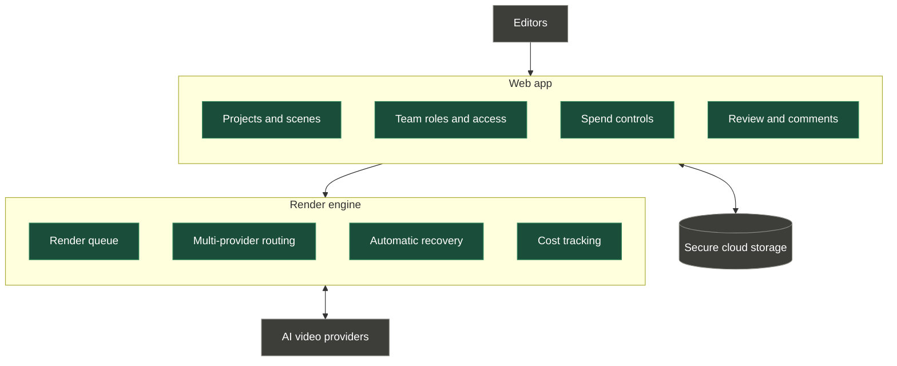

# Platform overview

What the platform does, without implementation detail. The full design is in
[`architecture.md`](architecture.md).

```mermaid
flowchart TB
    ED["Editors"]

    subgraph web["Web app"]
        direction TB
        W1["Projects and scenes"]
        W2["Team roles and access"]
        W3["Spend controls"]
        W4["Review and comments"]
    end

    subgraph engine["Render engine"]
        direction TB
        E1["Render queue"]
        E2["Multi-provider routing"]
        E3["Automatic recovery"]
        E4["Cost tracking"]
    end

    ST[("Secure cloud storage")]
    AI["AI video providers"]

    ED --> web
    web --> engine
    web <--> ST
    engine <--> AI

    classDef ours fill:#1a4d3a,stroke:#2d8659,color:#fff
    classDef ext fill:#3d3d3a,stroke:#888780,color:#fff
    class W1,W2,W3,W4,E1,E2,E3,E4 ours
    class ED,ST,AI ext
```
